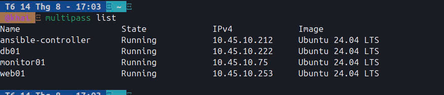
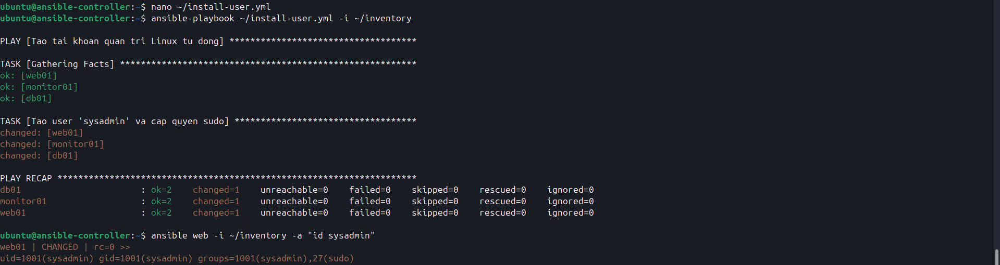
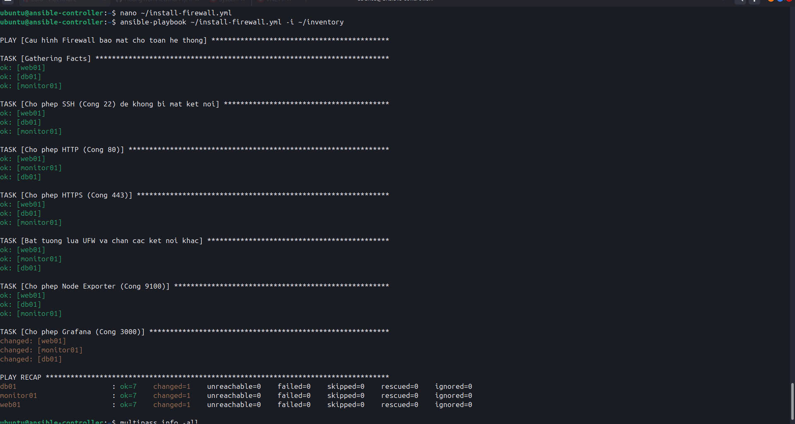
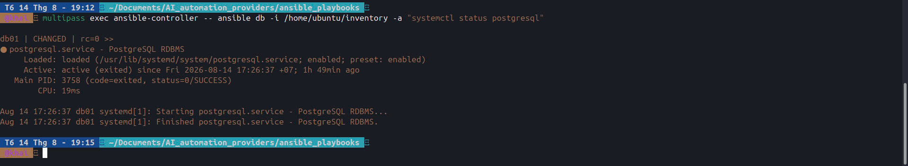

# AutoProvisioner AI

Automated Infrastructure Provisioning & High Availability Web Cluster powered by Ansible, Docker, and Telegram ChatOps.

> **[Hướng dẫn khởi động lại hệ thống (STARTUP_GUIDE.md)](STARTUP_GUIDE.md)**

---

## Kiến Trúc Hạ Tầng (System Architecture)

Hệ thống triển khai 5 nút dịch vụ độc lập với quy hoạch mạng chi tiết:

| Server Node | IP Address | Vai trò & Dịch vụ |
| :--- | :--- | :--- |
| **`ansible-controller`** | `10.45.10.212` | Nginx Reverse Proxy / Load Balancer & Ansible Master |
| **`web01`** | `10.45.10.84` | Web Application Node 1 (Docker Engine, App Runtime) |
| **`web02`** | `10.45.10.254` | Web Application Node 2 (Docker Engine, App Runtime) |
| **`db01`** | `10.45.10.150` | Database Node (PostgreSQL Engine) |
| **`monitor01`** | `10.45.10.48` | Monitoring & Logging Node (Prometheus, Grafana, Loki) |

---

## Tính Năng Trọng Tâm

- **Infrastructure as Code (IaC):** Tự động hóa 100% việc khởi tạo và cấu hình môi trường bằng Ansible Playbooks.
- **High Availability & Cân Bằng Tải:** Nginx phân phối lưu lượng truy cập giữa `web01` và `web02`, đảm bảo hệ thống duy trì hoạt động ngay cả khi 1 node gặp sự cố.
- **Bảo Mật & Tường Lửa:** Tự động thiết lập UFW Firewall, chỉ mở các cổng giao tiếp bắt buộc và phân quyền nghiêm ngặt qua SSH Keypair.
- **Sao Lưu Dữ Liệu Tự Động:** Ansible Playbook tự động dump và nén sao lưu CSDL PostgreSQL theo định kỳ.
- **Giám Sát & Thu Thập Log Tập Trung:** Ngăn xếp Prometheus + Grafana + Loki + Promtail thu thập chỉ số tài nguyên và syslog thời gian thực.
- **Telegram ChatOps:** Điều khiển và giám sát hạ tầng trực tiếp qua tin nhắn Telegram:
  - `/deploy` - Kích hoạt CI/CD cập nhật mã nguồn mới.
  - `/status` - Kiểm tra thông số CPU, RAM, Uptime toàn cụm server.
  - `/backup` - Ra lệnh sao lưu CSDL tức thì.
  - `/restart_web` - Khởi động lại các container ứng dụng.
  - `/block_ip <IP>` - Chặn địa chỉ IP nghi vấn trên hệ thống tường lửa.
  - `/logs` & `/db_size` - Tra cứu log lỗi và dung lượng CSDL.

---

## Minh Chứng Triển Khai (Proof of Concept)

### 1. Hạ Tầng & Tự Động Hóa Ansible
- **Khởi tạo Nodes (Multipass):**
  

- **Ansible Automation Ping Test:**
  

- **Cấu hình Nginx Load Balancer & UFW Firewall:**
  

- **Sao Lưu CSDL PostgreSQL:**
  

---

### 2. Cân Bằng Tải & Giao Diện Web
- **Điều hướng lưu lượng tới `web01` (`10.45.10.84`):**
  

- **Điều hướng lưu lượng tới `web02` (`10.45.10.254`):**
  

---

### 3. Telegram ChatOps
- **Kiểm tra trạng thái hệ thống (`/status`):**
  

- **Chặn IP tấn công (`/block_ip`):**
  

- **Thực thi sao lưu CSDL (`/backup`):**
  

---

### Video Demo Thực Tế
- **[Video Demo Lệnh ChatOps](https://youtube.com/shorts/OJx1HamoE5Q)**
- **[Video Demo ChatOps & CI/CD Deployment](https://youtube.com/shorts/bH1r4yzjVTc)**

---

## Lộ Trình Phát Triển (Future Roadmap)

- **PostgreSQL High Availability:** Triển khai mô hình Replication (Master-Slave) với Patroni/Repmgr để tự động chuyển vùng sự cố (Failover).
- **Chiến Lược Backup 3-2-1:** Tự động đồng bộ bản sao lưu ra Storage Server (NAS) độc lập, cách ly để bảo vệ dữ liệu khỏi Ransomware.
- **Cân Bằng Tải Dự Phòng (Keepalived & HAProxy):** Thiết lập IP ảo (Virtual IP) cho cụm Load Balancer chống đơn điểm sự cố (Single Point of Failure).
- **Bảo Mật Nâng Cao:** Triển khai Fail2Ban chống Brute-force và kết nối quản trị qua WireGuard VPN.
