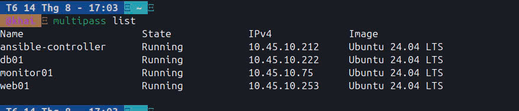
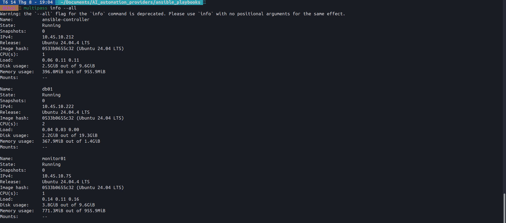
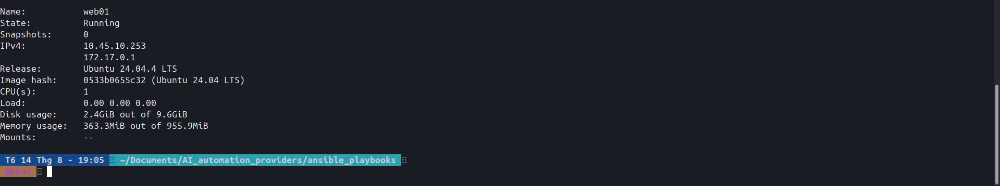
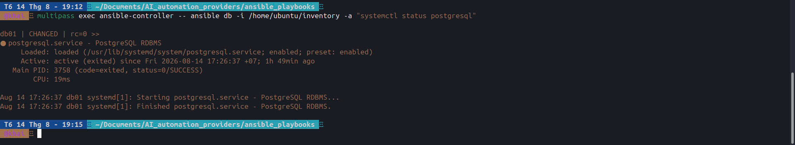
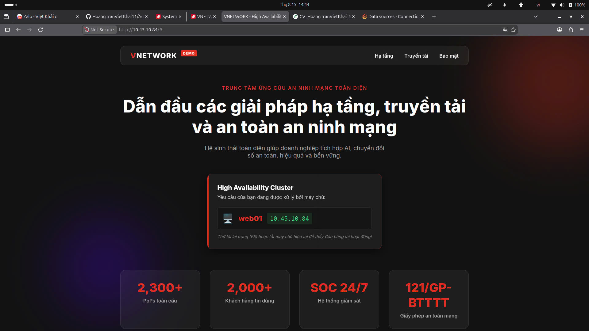
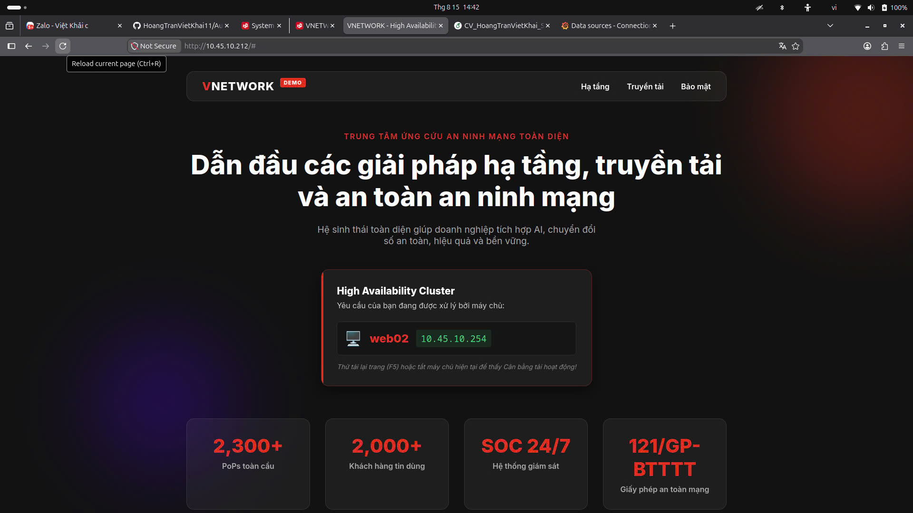
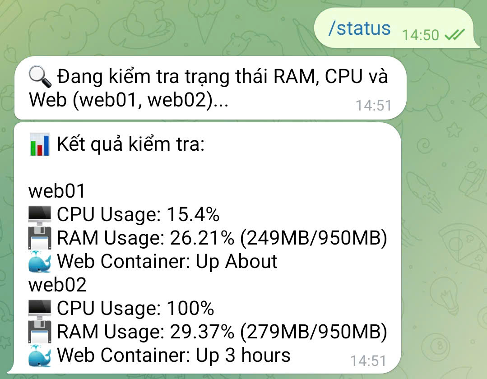
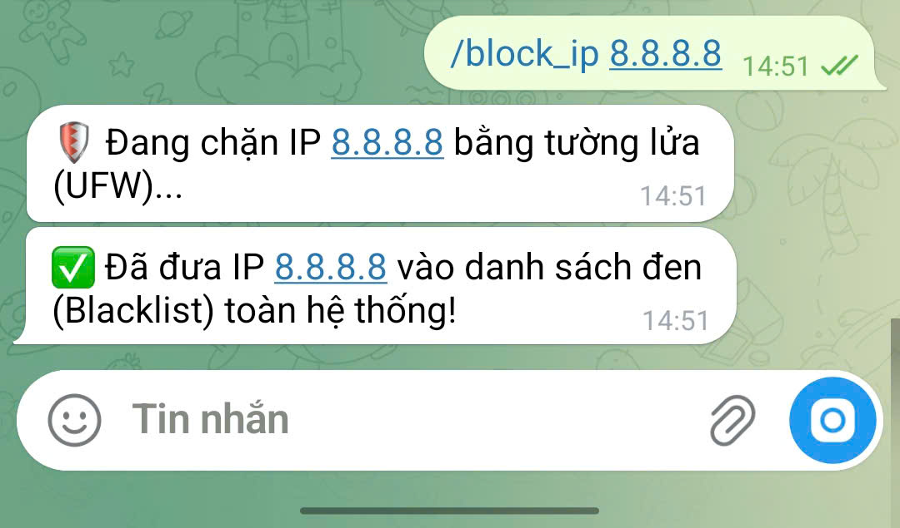
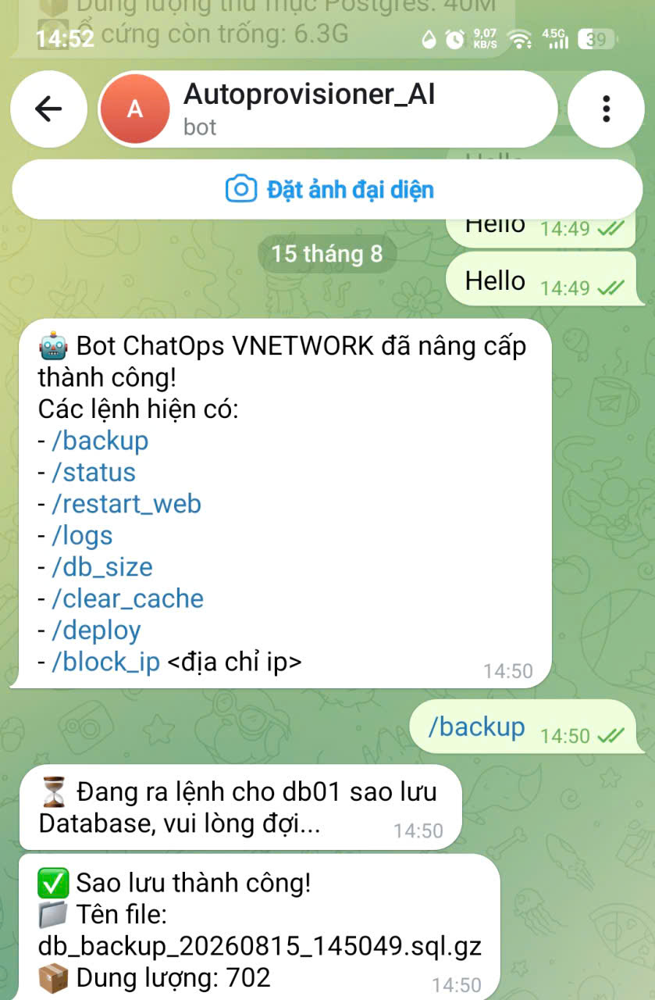

# AutoProvisioner - Nền tảng Tự động hóa Hạ tầng

## Mô tả dự án (Overview)
**AutoProvisioner** là nền tảng tự động hóa toàn bộ quy trình triển khai và cấu hình hạ tầng máy chủ bằng mã lệnh (Infrastructure as Code). Dự án được thiết kế để giải quyết bài toán vận hành nhiều máy chủ Linux cùng lúc một cách nhanh chóng, bảo mật và nhất quán.

Hệ thống có khả năng tự động hóa việc kết nối SSH, thiết lập tường lửa, triển khai ứng dụng (Docker, PostgreSQL) và tích hợp hệ thống giám sát (Prometheus, Grafana) trên cụm máy ảo.

## Công nghệ sử dụng (Tech Stack)
* **OS:** Ubuntu 24.04 LTS
* **Automation:** Ansible
* **Containerization:** Docker
* **Database:** PostgreSQL
* **Monitoring:** Prometheus, Node Exporter, Grafana
* **Security:** UFW (Uncomplicated Firewall), SSH Keys
* **Automation & ChatOps:** Telegram Bot API

## Kiến trúc hệ thống (Architecture)
Hệ thống được chia thành 5 máy chủ riêng biệt đảm nhận các vai trò khác nhau:

1. **`ansible-controller`**: Máy trung tâm điều khiển cấu hình toàn hệ thống, đồng thời đóng vai trò là **Nginx Load Balancer** cân bằng tải giao thông web.
2. **`web01`, `web02`**: Cụm máy chủ Web chạy Docker, sẵn sàng phục vụ và đảm bảo tính **High Availability (HA)**.
3. **`db01`**: Máy chủ CSDL chạy PostgreSQL.
4. **`monitor01`**: Máy chủ Giám sát chạy Prometheus và Grafana.

## Các tính năng đã triển khai (Features)
- **Bảo mật mạng (Security):** Tự động cấu hình kết nối SSH Key và thiết lập tường lửa UFW (chỉ mở cổng 22, 80, 443, 3000, 9090, 9100).
- **Quản lý người dùng (User Management):** Tự động tạo và cấp quyền `sudo` cho tài khoản quản trị trên toàn bộ Cluster.
- **Web Server Automation:** Tự động cài đặt Docker và Docker Compose cho cụm Web.
- **Database Automation:** Tự động cài đặt, khởi động PostgreSQL và đặt lịch Cronjob.
- **High Availability & Load Balancing:** Tự động cấu hình Nginx Load Balancer phân tải Round-robin xuống 2 máy chủ Web, đảm bảo hệ thống không bao giờ bị gián đoạn (Zero downtime) khi 1 máy bị sập.
- **Monitoring & Alerting:** Thu thập chỉ số (CPU, RAM) bằng Node Exporter, trực quan hóa qua Grafana và tự động gửi cảnh báo qua Telegram khi CPU quá tải.
- **ChatOps (Remote Control Center):** Tích hợp **Bot Telegram** đa năng cho phép quản trị viên ra lệnh từ xa bằng điện thoại:
  - `/status`, `/db_size`, `/logs`: Giám sát và trích xuất nhật ký lỗi từ xa.
  - `/block_ip`: Ngăn chặn tấn công DDoS bằng cách khóa IP toàn hệ thống (UFW).
  - `/deploy`, `/clear_cache`, `/restart_web`: Triển khai mã nguồn và xử lý sự cố.
  - `/backup`: Tự động đóng gói và sao lưu Database PostgreSQL.

---

## Hình ảnh thực tế dự án (Proof of Work)

**1. Khởi tạo cụm 4 máy chủ (VM Provisioning):**

**2. Chạy kịch bản tự động hóa bằng Ansible:**

**3. Tự động cấu hình Database PostgreSQL:**

**4. Hệ thống giám sát tài nguyên Grafana (Real-time):**

**5. Giao diện Web & Tính năng Cân bằng tải (Load Balancer):**
- **Ảnh 1:** Chụp màn hình trang web hiển thị chữ `web01` và địa chỉ IP `10.45.10.84`.

- **Ảnh 2:** Chụp màn hình trang web sau khi bấm F5, hiển thị chữ `web02` và IP `10.45.10.254`.

**6. ChatOps - Điều khiển hạ tầng qua Telegram:**
- **Ảnh 1:** Chụp màn hình điện thoại khi bạn gõ lệnh `/status` và Bot trả về % CPU, RAM, Uptime.

- **Ảnh 2:** Chụp màn hình cảnh bạn gõ `/block_ip 8.8.8.8` và Bot báo chặn Firewall thành công.

- **Ảnh 3:** Chụp màn hình lệnh `/backup` thành công hiển thị dung lượng file nén.

- **Video 1 (test toàn bộ lệnh của chatbot)**: 
[🎥 Bấm vào đây để xem Video Demo Test ChatOps](img/chatbot/chatops/video01/89503423752091132741.mp4)
- **Video 2 (ChatOps & CI/CD):** Quay màn hình điện thoại thao tác gõ lệnh `/deploy` và `/restart_web` cực mượt mà.
[🎥 Bấm vào đây để xem Video Demo ChatOps Operations](img/chatbot/chatops/video2/5855831333754878758.mp4)
